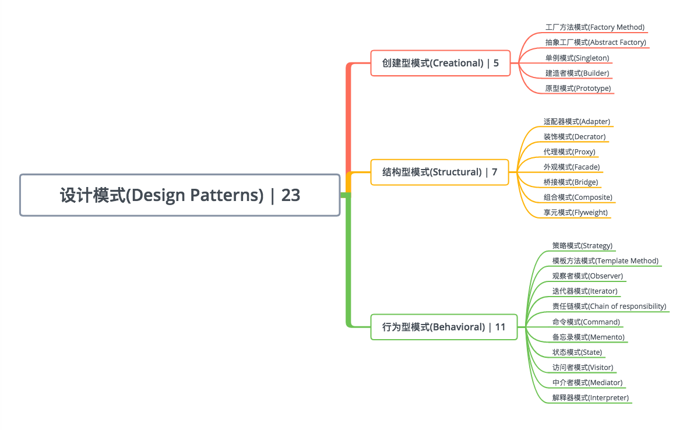

# iOSDesignPatterns

iOS各种设计模式实践
概念 | 特点 | 核心角色 | UML

## 设计模式(`DesignPatterns`) | 23
#### 创建型模式(`Creational`) | 5
* [工厂方法模式(`Factory Method`)](https://github.com/binzi56/iOSDesignPatterns/tree/master/iOSDesignPatterns/Creational/FactoryMethod)
* [抽象工厂模式(`Abstract Factory`)](https://github.com/binzi56/iOSDesignPatterns/tree/master/iOSDesignPatterns/Creational/AbstractFactory)
* [单例模式(`Singleton`)](https://github.com/binzi56/iOSDesignPatterns/tree/master/iOSDesignPatterns/Creational/Singleton)
* [建造者模式(`Builder`)](https://github.com/binzi56/iOSDesignPatterns/tree/master/iOSDesignPatterns/Creational/Builder)
* [原型模式(`Prototype`)](https://github.com/binzi56/iOSDesignPatterns/tree/master/iOSDesignPatterns/Creational/Prototype)
#### 结构型模式(`Structural`) | 7
* [适配器模式(`Adapter`)](https://github.com/binzi56/iOSDesignPatterns/tree/master/iOSDesignPatterns/Structural/Adapter)
* [装饰模式(`Decrator`)](https://github.com/binzi56/iOSDesignPatterns/tree/master/iOSDesignPatterns/Structural/Decrator)
* [代理模式(`Proxy`)](https://github.com/binzi56/iOSDesignPatterns/tree/master/iOSDesignPatterns/Structural/Proxy)
* [外观模式(`Facade`)](https://github.com/binzi56/iOSDesignPatterns/tree/master/iOSDesignPatterns/Structural/Facade)
* [桥接模式(`Bridge`)](https://github.com/binzi56/iOSDesignPatterns/tree/master/iOSDesignPatterns/Structural/Bridge)
* [组合模式(`Composite`)](https://github.com/binzi56/iOSDesignPatterns/tree/master/iOSDesignPatterns/Structural/Composite)
* [享元模式(`Flyweight`)](https://github.com/binzi56/iOSDesignPatterns/tree/master/iOSDesignPatterns/Structural/Flyweight)
#### 行为型模式(`Behavioral`) | 11
* [策略模式(`Strategy`)](https://github.com/binzi56/iOSDesignPatterns/tree/master/iOSDesignPatterns/Behavioral/Strategy)
* [模板方法模式(`Template Method`)](https://github.com/binzi56/iOSDesignPatterns/tree/master/iOSDesignPatterns/Behavioral/TemplateMethod)
* [观察者模式(`Observer`)](https://github.com/binzi56/iOSDesignPatterns/tree/master/iOSDesignPatterns/Behavioral/Observer)
* [迭代器模式(`Iterator`)](https://github.com/binzi56/iOSDesignPatterns/tree/master/iOSDesignPatterns/Behavioral/Iterator)
* [责任链模式(`Chain of responsibility`)](https://github.com/binzi56/iOSDesignPatterns/tree/master/iOSDesignPatterns/Behavioral/ChainOfResponsibility)
* [命令模式(`Command`)](https://github.com/binzi56/iOSDesignPatterns/tree/master/iOSDesignPatterns/Behavioral/Command)
* [备忘录模式(`Memento`)](https://github.com/binzi56/iOSDesignPatterns/tree/master/iOSDesignPatterns/Behavioral/Memento)
* [状态模式(`State`)](https://github.com/binzi56/iOSDesignPatterns/tree/master/iOSDesignPatterns/Behavioral/State)
* [访问者模式(`Visitor`)](https://github.com/binzi56/iOSDesignPatterns/tree/master/iOSDesignPatterns/Behavioral/Visitor)
* [中介者模式(`Mediator`)](https://github.com/binzi56/iOSDesignPatterns/tree/master/iOSDesignPatterns/Behavioral/Mediator)
* [解释器模式(`Interpreter`)](https://github.com/binzi56/iOSDesignPatterns/tree/master/iOSDesignPatterns/Behavioral/Interpreter)
